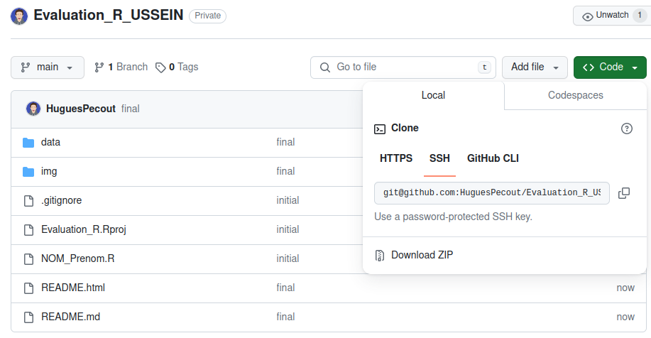
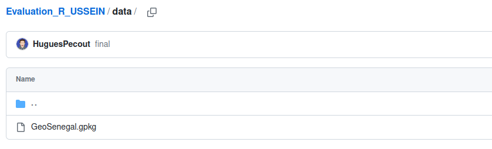
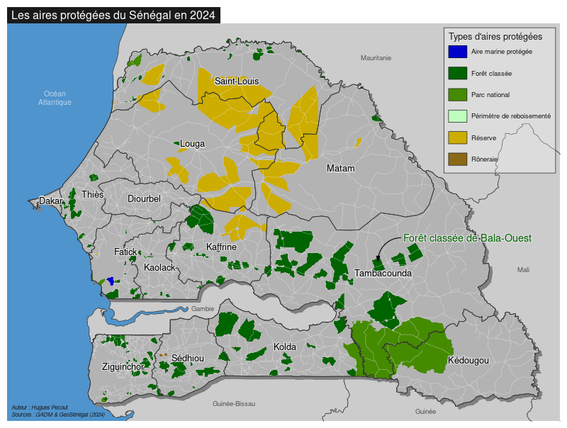

# Evaluation pour le cours *Géomatique avec R* 

### Master Géomatique - Université du Sine Saloum El-Hâdj Ibrahima NIASS

*Hugues Pecout (CNRS, UMR Géographie-Cités)*

 

#### **A. Téléchargement de l’espace de travail et des données**

Téléchargez le projet Rstudio mis à disposition sur le dépôt : [**https://github.com/HuguesPecout/Evaluation_R_USSEIN**](https://github.com/HuguesPecout/Evaluation_R_USSEIN)

Pour cela, cliquez sur le bouton vert ***Code***, puis  sur ***Download ZIP***.   

 

Une fois le dossier décompréssé, lancez le projet Rstudio en double-cliquant sur le fichier **Evaluation_R.Rproj**.

 

#### **B. Script R à rendre**

**Renommez le fichier** ***NOM_Prenom.R*** **avec votre NOM et votre Prénom. N'utilisez pas de caractères spéciaux, ni d'espaces.**

**Réalisez l'ensemble de l'exercice dans ce fichier**. Une fois terminé, **renvoyez UNIQUEMENT CE FICHIER par mail à l'adresse :** **hugues.pecout[@]cnrs.fr**

**Assurez-vous bien que le script fonctionne avant de l'envoyer**. Pour cela vous pouvez relancer votre session R (ctrl+shift+F10) puis relancez le script. Vous pouvez aussi faire éxécuter votre script par l'un ou l'une de vos camarades.

 

#### **C. B. Données à disposition**

Pour réaliser l'exercice, vous avez à disposition un **fichier GeoPackage** (**GeoSenegal.gpkg**) contenant 8 couches géographiques :

- **Pays_voisins** : Couche des frontières du Sénégal et de l'ensemble de ses pays limitrophes. Source : https://gadm.org/, 2014   
- **Senegal** : Couche des frontières du Sénégal. Source : https://gadm.org/, 2014   
- **Regions** : Couche des régions sénégalaises. Source : https://gadm.org/, 2014   
- **Departements** : Couche des départements sénégalais. Source : https://gadm.org/, 2014   
- **Localites** : Couche de points des localités sénégalaises. Source : Base de données géospatiales prioritaires du Sénégal. https://www.geosenegal.gouv.sn/, 2024. 
- **USSEIN** : Localisation de l'Université du Sine Saloum El-hâdj ibrahima NIASS. Source : Google Maps, 2014. 
- **Routes** : Couche du réseau routier sénégalais. Source : Base de données géospatiales prioritaires du Sénégal. https://www.geosenegal.gouv.sn/, 2024. 
- **Aires_protegees** : Couche des aires protégées sénégalaises. Source : Base de données géospatiales prioritaires du Sénégal. https://www.geosenegal.gouv.sn/, 2024. 

 

#### **D. B. Système de notation**

**Vous devez apporter un soin particulier à la présentation du code. Il doit être lisible aéré et commenté. La clarté de votre code ainsi que le respect des consignes sera noté sur 4 points.** Le reste du barême est indiqué dans les consignes ci-dessous. 

 

## **CONSIGNES**

#### **En vous aidant des manuels [Geomatique avec R](https://rcarto.github.io/geomatique_avec_r/) et [Cartographie avec R](https://rcarto.github.io/cartographie_avec_r/), réalisez les traitements suivants dans le fichier R renommé à votre nom**

 

#### 1. Import  des données

##### 1.1 Affichez la liste des couches géographiques contenues dans le fichier GeoPackage **GeoSenegal.gpkg**. (**0,25 pt**)

##### 1.2 Importez l'ensemble des couches géographiques contenues dans le fichier GeoPackage **GeoSenegal.gpkg**. (**0,25 pt**)

 

#### 2. Géocadage d'une adresse

##### 2.1 Géocodez l'adresse suivante "Gare de tambacounda, Sénégal". (**1 pt**)

##### 2.2 Construisez une couche géographique (point) à partir de la longitude et latitude récupérées. (**0.5 pt**)

##### 2.3 Reprojetez cette couche géographique en projection "WGS 84 / UTM zone 28N" . (**0.5 pt**)

##### 2.4 Vérifiez le géocodage de la gare de Tambacounda en affichant le point dans une carte interctive à l'aide de la librairie `mapview`. (**0.5 pt**)

 

#### 3. Séléction attributaire 

##### 3.1 Créez une nouvelle couche comportant uniquement les localités "Chef-lieu de département" (TYPELOCAL == 2). (**1 pt**)

 

#### 4. Calcul d'une matrice de distance à partir de la base de données OpenStreetMap 

##### 4.1 Calculez une matrice de distances routières et de distances temps entre la gare de Tambacounda et les chefs-lieux de département. (**1 pt**)

##### 4.2 Ajoutez ces distances routières et temps dans la couche géographique des chefs-lieux de département. Profitez-en pour convertir ces valeurs en kilomètre et en heure. (**1 pt**)

##### 4.3 Quel est le chef lieu de département le plus éloigné en temps de la gare de Tambacounda ? Combien d'heures faut-il (selon OpenStreetMap) pour rejoindre cette ville en voiture ? Affichez directement les réponses à ces deux questions dans la console. (**1 pt**)

 

#### 5. Nombre d'aires protegées dans un rayon de 100km de la gare de Tambacounda

##### 5.1 Créez une zone tampon de 50 Km autour de la gare de Tambacounda  (**0.5 pt**)

##### 5.2 Réalisez une séléction spatiale des aires protegees qui intersectent cette zone tampon de 50 km. (**1 pt**)

##### 5.3 Combien et quels sont les noms des aires protégées situées à moins de 50 km de la gare de Tambacounda ? Affichez les réponses à ces deux questions dans la console. (**1 pt**)

 

#### 6. Cartographie des aires protégées

##### 6.1 Découpez la couche géographiques des aires protégées en fonction des limites du Sénégal. (**1 pt**)

##### 6.2 Construisez une carte de typologie des aires protégées du Sénégal. (**3.5 pts**)

Vous êtes libre de choisir la mise en page que vous souhaitez. Vous êtes seulement obligés de : 

- Ajouter une annotation qui permet d'indiquer la localisation précise de la "Forêt classée de Bala-Ouest". 
- Ajouter des étiquettes avec le nom des différentes régions. 
- Ajouter tous les éléments obligatoires pour une carte thématique !

Voici un exemple simple de carte possible :

**Mais vous pouvez faire beaucoup mieux !**

 

##### 6.4 Ajoutez le code nécessaire pour exporter automatiquement cette carte (800 pixel de large) en format svg. (**1 pt**)

Attention, il sera sans doute nécéssaire de modifier la veleur de certains arguments pour avoir une belle carte !

 

#### 7. Question de cours

##### 7.1 Dans le docuement *Géomatique avec R*, retrouvez quelle fonction (de quel package ?) permet de découper une couche géographique raster en fonction de l'emprise d'une couche vectorielle. Indiquez la réponse en commentaire dans votre script. (**1 pt**)

 

